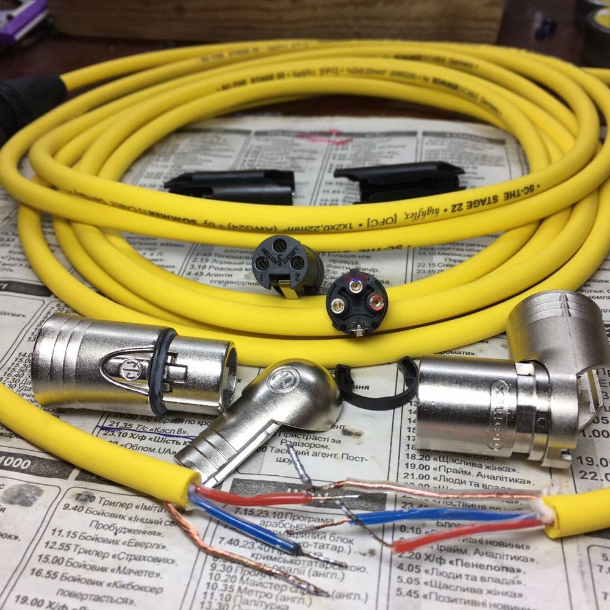

date: 2021-03-26 21:21:15
tgid: 22
----

Вирішив якось що мені для мікрофона вкрай потрібен жовтий кабель — це я ще Worker Bee користвувався, тож дуже підходило за кольором. А все шо є в магазах та всяких промах виключно сумних кольорів. 

Аж тут на олх знайшовся чувак, який робить кабелі на замовлення, і там у фотках було різне. Написав йому, ми домовилися на компоненти — бо можна було і дуже дорого зробити, але я щось посерединці обрав. 

І ось приходить нотіфікашка, що кабель їде, а паралельно в месенджер олх з 15 фоток подібного змісту, і з вимірами ємності, etc...

Чесно кажучи, я трішечки прозрів, у хорошому сенсі цього слова. Підхід до виготовлення кабелів за межами розумного, просто анріал. Не знаю, що мене може змусити піти кабель десь у іншому місці придбати. :) Ну може лише тільки поспіх)

Осьо він, якщо вдруг знадобиться (не реклама, я просто вражений максимально): [https://instagram.com/goodcable](https://instagram.com/goodcable)