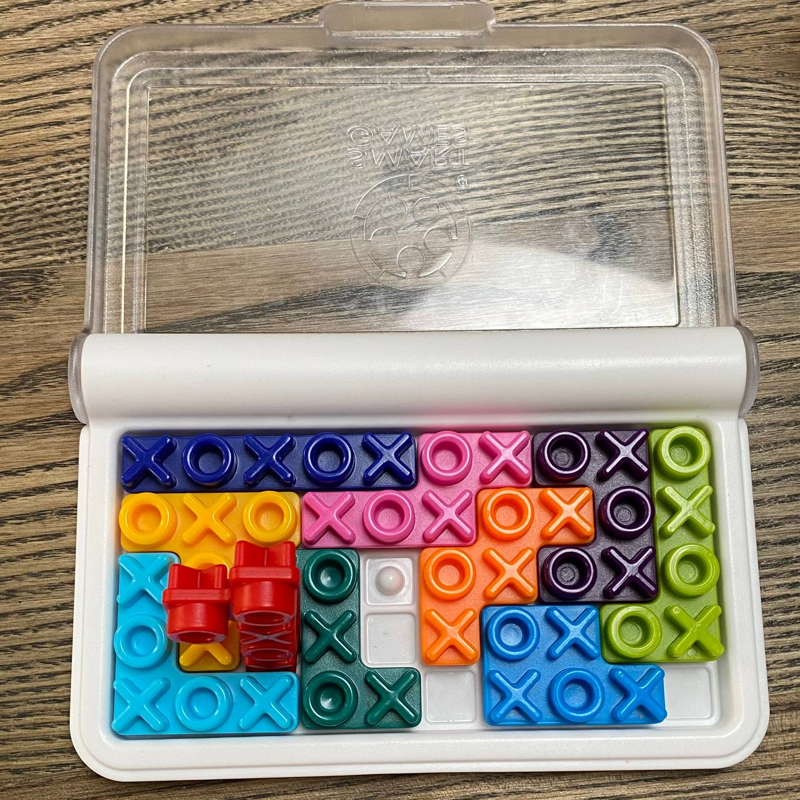

date: 2021-06-15 11:46:25
tgid: 58
----

Степану якось подарували пазл, шось на кшталт тетрісу: треба фігурки скласти так, щоб вони утворили прямокутник. Цьому заважає не тільки їх форма, але і рельєф — мізки нормально треба вмикати, особливо на рівнях поскладніше. 

Воно лежало без діла доволі довго, але тиждень тому якось ми на неї напали і активно розгадували (у сенсі не тіки Степан це робив)… аж тут козявка Фаня три дні тому кудись заховала книжечку із завданням. 

І тут виявилося, що ніхто з нас не спроможний просто скласти ці довбані фігурки. Дуже неприємне відчуття, чесно кажучи, наче знов на дворі 94 рік і мені потрібен iddqd щоб пройти перший рівень…