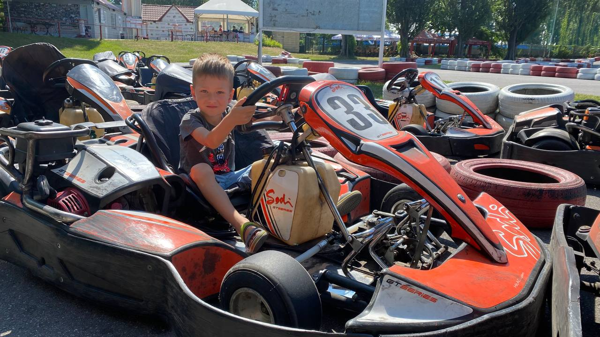

date: 2021-07-31 12:29:34
tgid: 64
----

Сьодні зі Степаном пішли на картінг — на «Жагу Швидкості», авжеж, бо де ще можна нормально проїхатися. :) І раптово виявилося, що вони останні два роки вже не пускають повозити дитину на руках. :( А самому йому ще рано, треба 130 см зросту, щоб дістати до газу (кому треба той тормоз). 

Тож довелося мені самому разочок проїхатися, тим більш що я там роки 3 вже не був — і перше коло за 43.3 дуже болісно про це нагадує. :)) Колись за 39 з копійками проїжджав сьогоднішню конфігурацію, а зара найкращий результат — 41.7 при тому, що крім мене на трасі тіки ще один чувак був. 

Але кльово, приємна втома в пальцях, хехе. Треба ще буде сходити. ;)