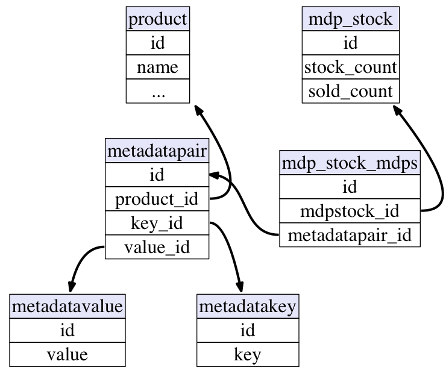
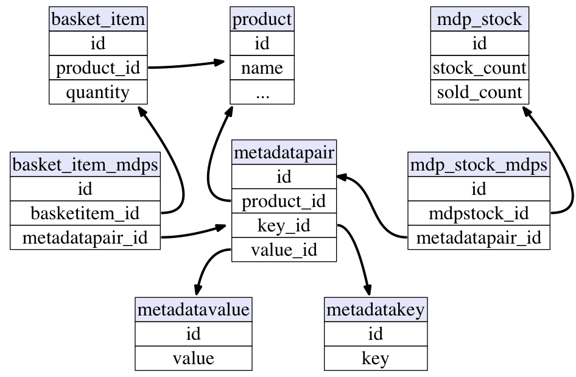

class: middle, center, invert

# Saving Black Friday
# Clojure to the Rescue

.meta[Alexander Solovyov, CTO @]
# 

???

Two years ago it already was one of the largest ecommerce platforms in
Ukraine. Built in Python/Django it couldn’t handle any spikes in traffic and was
hard to maintain and improve. How do you change a platform on the fly? A tale of
Clojure and ClojureScript, its incredible ecosystem and a crazy team which
brought bleeding edge technologies on the screens of hundreds of thousands of
people.

---

# What's modnaKasta

- Shopping club
- Founded in 2010
- Largest fashion-oriented ecommerce site in Ukraine
- Hundreds of thousands clients
- Hundreds of thousands orders
- 1k+ RPS every day (more so during events)

???

- Just an internet shop
- Everybody knows how to do that
- Write some code, have some clients, sell some stuff, no big deal.

---

# Early 2015

- Aging codebase - started in 2006 four teams ago
- 80k+ lines of Python
- Tons of issues
- Is a drag on business
  - hard to maintain
  - hard to fix
  - hard to improve
- Black Friday 2014 was a commercial success and ***lots of downtime***

???

- The "write some code" bit is not that easy as it could be, though.
- Stuff's more complex than it seems
- modnaKasta's Black Friday is the biggest one

---

class: middle, invert

# Why

---

# Meta&thinsp;data&thinsp;pairs

.center.middle[]

???

- That's my favorite story
- Benchmark inside the team for other disasters
- More or less understandable solution for KV-data
- Okayish design gone horribly wrong

---

# And we store various data there...

```sql
=# SELECT k.key, k.id, COUNT(p.id)
-# FROM product_metadatapair p
-# JOIN product_metadatakey k ON p.key_id = k.id
-# GROUP BY k.key, k.id
-# ORDER BY COUNT(p.id);
   key    | id |  count
----------+----+----------
 Объем    | 18 |       26  -- volume
          |  3 |       27  -- empty string
 Описание | 17 |      176  -- description
 Номер    |  2 |      443  -- number
 Pазмер   |  1 |     3112  -- size with latin "P"
 Размер   | 16 | 15212192  -- size
(6 rows)
```

???

- Empty key has empty values
- First letter of "Pазмер" is a latin one

---

# And stocks...

.center.middle[]

???

- Effectively MDP becomes a single SKU
- Can single SKU have multiple stocks? Why m2m?

---

# And basket!

.center.middle[]

???

- 25 mln records in basket item
- 1 BI - 1 sku, but m2m again

---

# Problems?

- 22 queries to DB for 1 size

--

- 110 queries to DB for 5 sizes

--

- Let's fix it with cache

--

background-image: url(img/facepalm.png)

- Which depends on user's basket, so is cached per-user

---

# Current state

.center.middle[]

???

- No m2m relations

---

# Black Friday 2015

- 10 months of optimization work
- Huge commercial success
???

- I started working there on January 2015
- We've spent whole 2015 grooming everything

--

- One mistake and 3 hours of downtime

---

class: middle, invert

# Fix

---

# How do you fix that

- Nobody knows original architecture ideas
  - Were there any ideas even?
- The system itself is convoluted
  - Lots of logic in models, overridden `.save()` methods and QuerySets
  - Implicit behavior
  - Not modular - fixes broke things
- Without caching it did at most 5 RPS on my laptop

???

- Stuff's bad
- You can go many ways
- But we had no idea what's going on inside

---

class: middle

# *REWRITE!*

---

# How do you rewrite a system

- Decide what the end state should be (high level)
- Do it bit by bit
- Smallest piece by smallest piece
- Be very careful
- Do not rush
- Update your old system to support new one
--

- **DO NOT RUSH**

---

# Clojure

- I like it
--

- Expressiveness
- Speed
- Sharing code between server and client
- Hot code reload that works
- Practical functional language
- Persistent data structures
- It's also fun!

???

- Simple
- Fast
- Crazy good community
- High quality libs
- FUN

---

# Single Page Application

- Simpler to make rich interactions with user
- Less data transfer/retrieval on page change
  - Lower load on the server
  - Lower load on the DB
- Unified API for web and mobile apps
- Slower initial load :(
  - Server-side rendering is a must
- React + Rum, if you wonder

???

- SPA is controversial
- I believe we mostly got it under control

---

# Nashorn?

- Takes up to 8 Gb per execution thread
- Start up takes up to 10 seconds
- I can't wait that much! :)

---

# Node.js

- HTTP server
  - Input: original request
  - Output: rendered page
- Manage pool of processes
- In case of overload render only for phones and bots

---

# Node.js HTTP server

```js
function handler(req, res) {
  res.writeHead(200, {"Content-Type": "text/html"});

  render_to_string(req.url, (initial, content) => {
    // Simplest template ever,
    // just a wrapper with html/head
    res.end(render_template(initial, content));
  });
}

http.createServer(handler).listen(6000);
```

???

- Most important stuff for SEO
- Render your current page
- Put it inside wrapper with `head` and return

---

# render_to_string

```js
function render_to_string(url, callback) {
  router.set_route(url);

  var comp = router.Root(data_store);

  // first time render to fire off all AJAX queries
  React.renderToString(comp);

  // wait for the queries to end
  xhr.current_queries.watch(function() {
    if (get_xhr_count() == 0) {
      callback(data_store, React.renderToString(comp));
    }
  });
}
```

???

- First renderToString triggers AJAX requests
- Then we wait until they end
- Then render second time with an actual data

---

# Are we happy?

- Get results through HTTP API with serialization :(
- Manage a pool of Node.js render servers :((
- Render everything twice :(((

???

- Did a render pool
- Bundle JS file inside of an app
- Put it on disk on start
- Run Node processes against it
- Freaking hell

--

# Not really

---

# Clojure to the rescue!

- Whole new app is in Clojure
- Front-end is in ClojureScript
- `.clj` - Clojure, `.cljs` - ClojureScript, `.cljc` - both
- Thanks Allen Rohner and Clojure/Conj 2015!

---

# ClojureScript

```
(defc Example []
  [:div.item {:on-click smile}
    [:span.inner "test"]])
```

```js
Example = React.createClass({
  render: function() {
    return <div class="item" onClick={smile}>
      <span class="inner">test</span>
    </div>;
  }
});
```

---

# Clojure

```
(defc Example []
  [:div.item {:on-click smile}
    [:span.inner "test"]])

(defn Example []
  [:div.item {:on-click smile}
    [:span.inner "test"]])
```

```
> (println (rum/render-html (Example)))

<div class="item">
  <span class="inner">test</span>
</div>
```

???

- But on the server the same code returns simple function
- So we can render it to a string
- The best kind of a solution - a simple one

---

# Wow!

- Yeah!
- Multi-threaded
- You can directly call API
  - no HTTP
  - no serialization!

---

# Database

- Postgres and migrations 💖
- No ORM
  - Implicit behavior complicates understanding
  - Over-fetch
  - 1+N queries etc
  - Impede understanding of a data layout

---

# Our way

```
{:select [:name :phone]
 :from   [:user_profile]
 :where  [:= :id 1]}
```

- Just a regular map, compose how you want
- Side-effect: people are learning SQL

---

class: middle, invert

# Results

---

# Clojure's app size

- 6k loc of API
- 13k loc of Front-end
- 5k loc of event stream processor
- Hard to compare

---

# Performance

- Median API response time - `18ms`
- Median server-side page rendering time - `70ms`
- Black Friday 2015: 18k online, 18 servers with Python, *dead*
- Black Friday 2016: 22k online, 8 servers with Clojure, *alive*
- Postgres is not breaking a sweat at 4k selects a second
- Clear path for further optimizations

???

- Thanks to small API calls optimizing performance became a simple task

---

# Page-by-page site rewrite

- `Apr '15`:&nbsp;&nbsp; first actual bits of code for new site
- `Nov '15`:&nbsp;&nbsp; first trial for a new site (heh)
- `Feb '16`:&nbsp;&nbsp; new main page released
- `Mar '16`:&nbsp;&nbsp; basket and order
- `May '16`:&nbsp;&nbsp; campaign
- `Nov '16`:&nbsp;&nbsp; checkout
- `Dec '16`:&nbsp;&nbsp; order list

???

- In summer 2015 it was slow
- Sped up in autumn
- Winter was where we did stuff

---

# Black Friday '16 was OK :)

- `0ms` downtime
- Thousands of happy customers
- Humbled marketing
- Happy business
- Revenue for a week equals to summer month

# Clojure FTW

---

class: middle, invert

# Questions?
