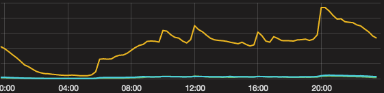

class: middle, center, invert, nonumber

# Saving Black Friday

.meta[Alexander Solovyov, CTO @]
# 

---

class: middle, center, invert, nonumber

---

class: middle, center, invert, nonumber

---

# Black Friday

- Это когда маркетинг пьян от трафика

--
- Это когда баеры выбивают последнюю скидочку

--
- Это когда логистика предчувствует боль

--
- Это когда колл-центр чувствует боль

--
- Это когда IT в ужасе

---

# Black Friday 2014

- Трафик 3х относительно обычного дня
- 30% рост конверсии
- 13 000 онлайн в пике

--
- В 8 вечера сайт не выдержал нагрузки
- .highlight[3 часа даунтайма]

---

class: nonumber, cover
background-image: url(img/downtime.jpg)

# Даунтайм

---

# 2015 год

- Оптимизация схемы БД
- Оптимизация запросов в БД
- Оптимизация вывода страниц
- Новые сервера для БД
- etc etc etc

---

# Black Friday 2015

- Трафик 2.5x от BF14
- 19 000 онлайн в пике

---

# Волны и кэш

.center[]

Как ускориться: не ходить в базу за информацией, пока не начнётся новая волна.

---

# Успех

- Нагрузка на базу ниже
- Нагрузка на веб-сервера ниже

--
- У балансировщиков нагрузки сбито время на 18 секунд
- В кэше устаревшие данные **на следующий час**

--

background-image: url(img/facepalm.png)

- После чистки кэша - .highlight[даунтайм на 2.5 часа]

---

# Black Friday 2016

- 1.5x от BF15
- 600 000 посетителей
- 100 000 покупателей
- 22 500 онлайн в пике
- 120 заказов в минуту

---

# Как?!

- Brand new platform
- Clojure/JVM
- Написанный руками SQL
- SPA

---

# Проблемы старой платформы

- Никто не знает изначальных архитектурных идей
  - Были ли они вообще?
- Система очень запутана
  - Неявное поведение: тяжело понять, что именно происходит
  - Сильная связность: исправления в одном модуле ломают другой
- Без кэширования 5 RPS на моём ноуте

---

# Как переписать систему

- Определить конечный результат
- Понемножку
- Минимальные кусочки системы по очереди
- Страничка за страничкой
- Осторожно
- Без спешки
- Обновляя старую систему для связности с новой

--
- **БЕЗ СПЕШКИ**

---

# Timeline

- Февраль '16: новая главная
- Март '16: корзина и заказ
- Май '16: акция
- Ноябрь '16: оформление заказа
- Декабрь '16: список заказов
- Апрель '17: каталог
- Июнь '17: профиль

---

# Результаты

- Медиана ответа API - 18ms (99% - 27ms)
- Медиана отрисовки целой страницы - 70ms
- Загрузка сервера БД: 30% в пике при 4k RPS
- 8 веб-серверов вместо 18
- **0ms даунтайма**
--

- Теперь IT ходит к маркетингу спросить, где трафик

---

class: middle, center, invert

# Вопросы?
