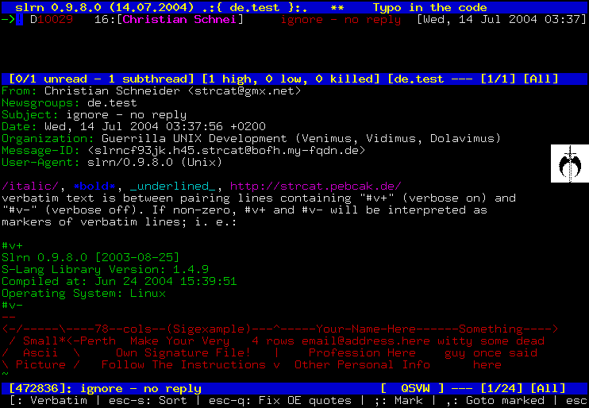
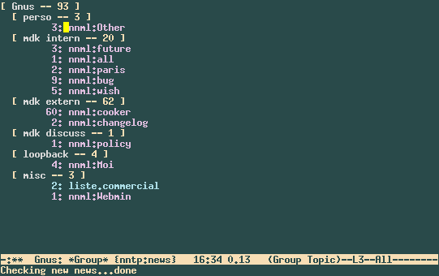

class: center, middle

# REPL

.meta[<p>Alexander Solovyov<br>CTO @ Kasta</p>]

---

class: center

# 2004



???

На дворе конец 2004-го, я, чтоб упростить модерацию NNTP-групп, написал себе
набор скриптов на перле для slrn и вима, которые форматировали сообщения для
выставления штрафов и в MySQL трекали сумму набранных баллов. Это моя первая
полноценная программа, если не считать лаб и курсовых в универе. :)

---

class: center

# 2005 



???

Мой друг Юра Сазонец написал свой набор скриптов для модерации, для Gnus'а,
программы чтения ньюсов в Emacs'е. Он очевидно круче работал, и так я
познакомился с Емаксом - после 3 лет ви. :)

Емакс, очевидно, был переворотом сознания: это вроде и редактор, но и
одновременно интерактивная среда, которая большей частью написана на том же
языке, на котором предполагается кастомизация.

И это позволяет вытворять совершенно безумные вещи, которые человеку, не
знакомому с происходящим, не прийдут в голову никогда.

У Саймака есть книга "На Юпитере", про то, что люди превращались в юпитерианское
животное, чтобы посмотреть на Юпитер и вернуться с рассказом, но никто не
возвращался. Никто не хотел обратно становиться человеком после того, как
побывал в таком облике.

С Емаксом ситуация похожая. :)

---

class: center

# 2008


???

К 2008 году я уже пошёл работать программистом и как-то оказалось, что Емакс -
это странное отвлетвление прогресса, и на самом деле ты не можешь по чуть-чуть
растить свои программы в своём IDE. 

Релоад хттп-сервера выбрасывает всё состояние, если третья форма отрендерилась
неправильно из-за данных из первой, начинай путь сначала, перепроверить
изменённый ЖС-хендлер можно только релоадом страницы и наклацыванием состояния.

Грусть.

В то же время я использовал (и дорабатывал) jabber- и irc-клиенты в емаксе, и
экспириенс разработки был совершенно другой, конечно.

Хотя писал я всё на питоне, который тоже имеет REPL, как в лиспе. Ну или шелл,
как ни назови.

---

class: middle, center


???

Разработчики Джанги старались, как могли разработчики, которые писали на
пайтоне. Шелл подгружал всякие хелперы, все его импрувили, и всё такое.

---

# Execute, fix, rince and repeat

```python
$ make shell
>>> from project.package import models
>>> models.call_something()
Exception
>>> ^D

# повторить, пока не заработает
```

???

Питон умеет перезагружать модули, но из-за накапливаемого в объектах и в
глобальных переменных и того, как построены проекты на питоне - релоад нормально
не работает. 

Всякие фласки и джанги на релоаде выбрасывают всё состояние, что могут и
импортируют всё заново, и это обычно работает, но иногда ломается.

Эксперименты в шелле в то же время все обычно делают выходом и входом и
накоплением состояния опять.

---

# REPL

* Read-Eval-Print Loop
* [Википедия про функциональность](https://en.wikipedia.org/wiki/Read%E2%80%93eval%E2%80%93print_loop#Functionality)
* Инструмент для изучения
* Инструмент для экспериментов
* Инструмент для тестов
* Инструмент для дебага и исправлений

---

# Изучение

## Тут всё ясно

* Дополнение
* Документация
* Исходный код

???

С изучением в принципе везде одинаково - разве что в JS в шелле доку не
почитаешь.

---

# Эксперименты

* Возможность быстро исполнить отдельное выражение
* Редактор, подключенный к реплу
* Репл, подключенный к программе
* Изменения программы на лету

???

Внезапно, тема экспериментов сильно шире, чем то, что предлагают нам шеллы
обычных языков. 

Нормальная для меня ситуация - когда я пишу функцию на кложе, я её части
исполняю, чтоб посмотреть, что результат ожидаемый. Более того, когда я функцию
дописал/изменил, я её тоже могу отправить в репл и она заменит собой текущую
имплементацию, в результате меняя поведение всей программы.

---

# Тесты

* Результаты экспериментов с функцией переносятся в тесты
* Код, который легко тестировать
* Не TDD, а DDT

???

В результате того, что разработка с REPL'ом обычно выглядит итеративно, bottom
up, и эксперименты легко перенести в тесты, и программа складывается из
кусочков, которые хорошо подходят для тестирования.

Не Test-Driven Development, а Development-Driven Testing

---

class: center


???

Интересно, что программа управления Deep Space 1 была написана на Common Lisp'е
(LispWorks), и получила награду `NASA Software of the Year 1999`. За то, что в
процессе полёта благодаря REPL'у удалось идентифицировать причину проблемы и
починить её.

> Drifting off course several light-minutes away from Earth

---

# Figwheel

* figwheel.org
* Live Reload для CLJS
* REPL для CLJS
* Life-changing опыт

???

Не хочется забыть упомянуть Figwheel, который вырос из того, как обычно на
функциональных языках разрабатывают. Это проект, который даёт REPL из редактора
прямо в браузер, так что можно менять поведение SPA, и заодно следит за
изменениями файлов и апдейтит код в браузере сам.

У ЖС, несмотря на то, что это в теории должно работать, на практике классы,
состояние в разных неожиданных местах и вообще общий подход делают сложным
работу обновления по живому. Более того, долго этим назывался автоматический
релоад страницы после изменения файла.

---

class: center, middle

# Демо

---

# Ссылки

* http://vvvvalvalval.github.io/posts/what-makes-a-good-repl.html
* https://vimeo.com/230220635
* https://www.youtube.com/watch?v=Ngt29DyNDRM
* https://en.wikipedia.org/wiki/Deep_Space_1#Remote_Agent
