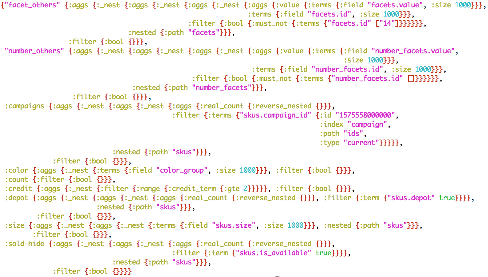

class: center, middle

# Clojure makes ElasticSearch bearable

.meta[<p>Alexander Solovyov<br>Head Of Product @ Kasta</p>]

???

- Что такое Эластик
- Проблема
- Ханискл
- Другие подходы
- (переформулировывание проблемы) кверистринг - наш дсл
- Подход к решению/решение
- Проблемы/радость/етц

---

# Кто здесь

- ex-CTO Kasta.ua (предыдущие 4 года)
- Head of Product теперь
- Но память не отшибло

???

Я теперь хед оф продакт, а не СТО в касте: отвечаю за развитие сайта и
приложений. Но и память на месте, и большая часть решения у меня в голове
собралась, так что рассказ будет технический, не с продуктовой точки зрения. :)

---

# ElasticSearch

## Search and analytics engine

- Поисковый движок
- Агрегации, фильтры, етц

???

По сути, это база данных, которая оптимизирует совсем другие паттерны доступа,
чем постгрес, чем нам и интересна.

---

# Синтаксис запросов

```
{:query {:filter {:term  {"affiliation" "Женщинам"}}}
 :aggs  {:kind   {:terms {:field "kind"}}}}
```

???

Простейшая структура данных, казалось бы - бери и пиши руками, это же кложа.

---

# HoneySQL: DSL для SQL-запросов

```
{:from   [[:product :p]]
 :join   [[:product_sku :s] [:= :s.product_id :p.id]]
 :select [:p.name :p.description :p.properties 
          [(db/json-agg :s.size :s.price) :skus]]
 :where  [:= :p.id 1]}
```

- Понятно
- Composable

???

Очень похоже на хани, который мы много используем. Очень удобно, всё понятно, и
у нас куча опыта работы с такими запросами - казалось бы, перенеси этот опыт на
эластик и всё поедет.

---



???

```
{:aggs
 {:color 
  {:filter {:bool {}}
   :aggs   {:_nest {:terms {:field "color_group", :size 1000}}}

  "facet_others"
  {:filter {:bool {}}
   :aggs   {:_nest
    {:nested {:path "facets"},
     :aggs
     {:_nest {:filter {:bool {:must_not {:terms {"facets.id" [:14 :12 :11 :13 :126 :35 :17 :19 :2 :281 :15 :3]}}}},
              :aggs   {:_nest {:terms {:field "facets.id", :size 1000}
                               :aggs {:value {:terms {:field "facets.value", :size 1000}}}}}}}}}}

  :depot
  {:filter {:bool {}}
   :aggs   {:_nest
    {:nested {:path "skus"},
     :aggs   {:_nest {:filter {:term {"skus.depot" true}},
                      :aggs   {:real_count {:reverse_nested {}}}}}}}}}}}
```

???

Проблема в том, что запросы в эластик в реальном мире совершенно другие, чем в
SQL. Намного больше, длиннее, значительно более динамические. Другой паттерн
использования совсем. Их сильно тяжелее писать и еще тяжелее читать.

---

# Ну функции же всё победят?

- Одна другую вызывает и всё сгенерируется
- Только разные агрегации - разные
- if/case/cond лезут везде
- Параметризация функциями
- Бла-бла-бла, писали в 2015-м
- Новые фичи дописывать тяжело, код хрупкий

???

Еще в конце 2015 у нас отрос коннектор к эластику, который в течении годов
дописывался и модифицировался. И каждый раз это сопровождалось страданиями,
потому что параметризация функциями превращает и так непростой код в
геморрой. Данных много, читать запросы в эластик бывает тяжело даже частями, и
нелинейность кода совсем уничтожает понимание.

---

class: middle

# Варианты подходов

???

Я регулярно посматривал по сторонам, потому что необходимость переписывания была
очевидной, но что делать - непонятно.

---

# elasticsearch-dsl.readthedocs.io

```
s = Search(using=client, index="my-index") \
    .filter("term", category="search") \
    .query("match", title="python")   \
    .exclude("match", description="beta")

s.aggs.bucket('per_tag', 'terms', field='tags') \
    .metric('max_lines', 'max', field='lines')
```

----

Как структуры данных, только еще и мутабельное.

???

У прома еще было что-то подобное, не знаю, куда подевалось. Для кложи особенного
смысла не имеет, имхо, оно не сильно отличается от написания структуры данных
руками (с помощью 5 хелперов).

---

# elastic-builder.js.org

```
var requestBody = esb.requestBodySearch()
    .query(esb.matchQuery('message', 'this is a test'))
```

----

Опять DSL для DSL, еще и терминология новая

???

То же самое, только в профиль, и еще matchQuery нарисовался, не похоже на слова
в доках самого эластика.

---

# Проблема

- Никто не пишет статьи "как мы конструируем запросы в ES"
- У ES сложные запросы: длинные, с большой вложенностью
- DSL и так нормальный для Clojure, сильно не улучшишь
- Хороший вопрос - половина ответа

???

Легко нагуглить статьи о том, как сделать тот или иной запрос. Даже есть шансы
почитать, как разложить данные в эластике правильно. Но реально ничего не
нашлось на тему того, как же собирать эти запросы - надо может описать - так,
чтоб через полгода глаза не вытекли, когда ты хочешь добавить какую-то фичу.

---

class: middle, center

## Переформулирование проблемы

# Query String - наш DSL

QS от браузера к API в смысле, типа `?kind=Сумки`

???

Не знаю почему, но вот именно это для меня было лампочкой возле головы, как в
мультиках. Я в какой-то момент осознал, что надо написать HoneySQL-like
преобразовывалку для кверистринга.

---

# Решение

- Прямой пайплайн (поменьше ветвления)
- Мультиметоды
- Небольшой словарь выражений поверх сырых структур данных

???

Я даже заглянул в исходники HoneySQL, и там ровно такой же подход, как получился у меня. :)

---

# Пайплайн

- `qs->query` - парсим query string
- `make-aggs-q` - конвертируем в запрос для ES
- Запрос в Эластик
- `aggs->response` - конвертируем в ответ API

???

Переделали qs и урл во внутреннюю структуру данных (набор нескольких мап),
сгенерировали запрос в эластик, запроцессили ответ эластика. Ну как бы очевидно.

---

# Дополнительный DSL

- `(defn not* [x]    {:bool {:must_not x}})`
- `(defn and* [& xs] {:bool {:filter xs}})`
- `(defn or*  [& xs] {:bool {:should clauses}})`
- `term=`, `term!=`
- `agg-nested`
- `agg-filter`
- `>=`, `<=`

???

Я внимательно всё пересмотрел, и это вроде все функции, которые можно засчитать
DSL'ем. Они все сложности примерно такой же, как and/not/or.

---

# `make-aggs-q`

- Самое неприятное место
- Конкатенирует
  - Список не-фасетных агрегаций
  - Список упомянутых в запросе фасетных агрегаций
  - Запросы на остальные фасетные агрегации
- Делегирует собственно генерацию в мультиметод `make-agg`

???

Это единственное действительно сложное место, его было тяжело продумать было и
код до сих пор не нравится, но кто-то должен делать грязную работу. :)

---

```
(defmethod make-agg :depot [k _ filters _]
  [k (-> {:filter (filters/term= "skus.depot" true)
          :aggs   {:real_count {:reverse_nested {}}}}
         (agg-nested "skus")
         (agg-filter (filters/make filters)))])
```

----

Эта агрегация ищет скушки (размеры товара), которые есть у нас на складе. Это
вложенный словарь в товаре, поэтому `agg-nested`. А потом надо зафильтровать
остальными фильтрами, которые применил пользователь. Так как это вложенная
фильтрация, то реальное количество тоже сложно получить.

???

Это пример того, как создаётся агрегация. Она возвращает своё имя и запросик для
агрегации. Суть агрегации, затем эластику надо напомнить, что она вложенная, а
затем отфильтровать всеми фильтрами (из них исключён фильтр для этой агрегации,
если он есть).

---

# `aggs->response`

Вызывает в цикле `extract-agg`, который превращает результаты ES в часть ответа
API, выбрасывает лишние фильтры, сортирует их, етц.

---

```
(defmethod extract-agg :depot [k agg query]
  (let [cnt (-> agg :real_count :doc_count)]
    [{:id        k
      :widget    :toggle
      :values    [{:key       "true"
                   :doc_count cnt}]
      :doc_count cnt}]))
```

----

Добыли данные, придали ту форму, который приходит в API.

---

# Divide and conquer

- Ничего нового
- Правильный факторинг
- Идея только не сразу приходит

???

Всё давно всем известно: чтоб что-то получилось хорошо, нужно сделать это
просто. Только это совсем не просто. :)

---

# Результаты

- Только одно сложное место: `make-aggs-q`
- Никакой параметризации функциями
- Всё ровное, как бревно
- Расширяемость на грани фантастики

???

Главный результат на самом деле то, что это место перестало быть ботлнеком вида
"а в этой фиче надо переделать запрос в эластик, давайте отложим".

---

class: middle, center

# Мораль

## Чтоб сделать хорошо, надо сначала поесть того, что получилось сразу

???

Это не самое сложное место в приложении, и не самое сложное в жизни, но иногда так
хорошо заняться какой-то конкретной проблемой. :)

---

# Ссылки

* http://nathanmarz.com/blog/suffering-oriented-programming.html
* https://project-a.github.io/on-site-search-design-patterns-for-e-commerce/
