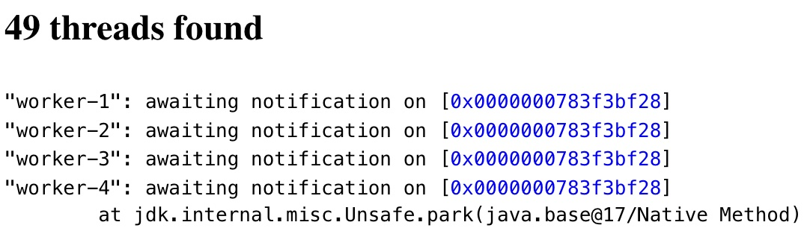
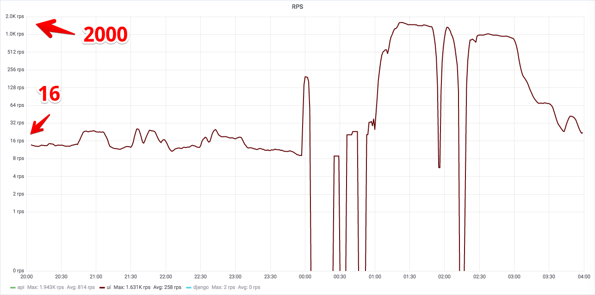
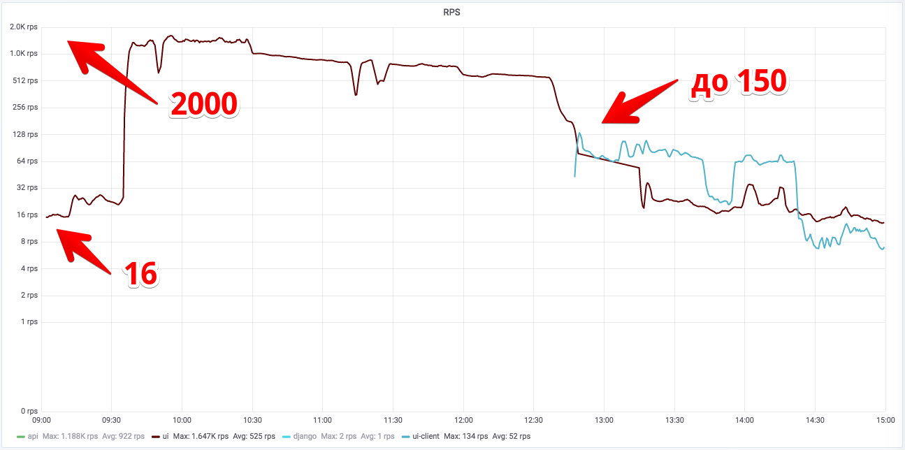
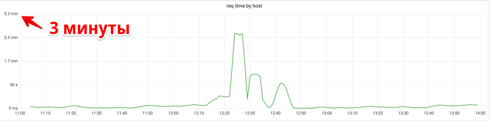
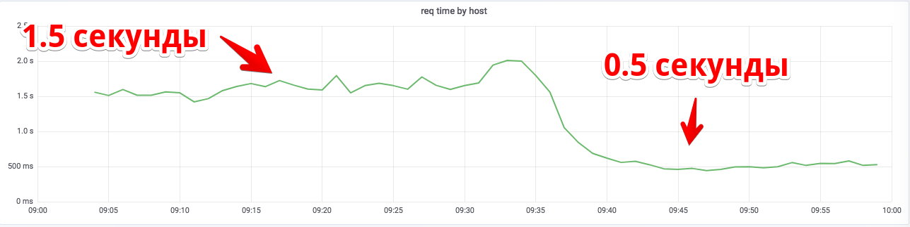
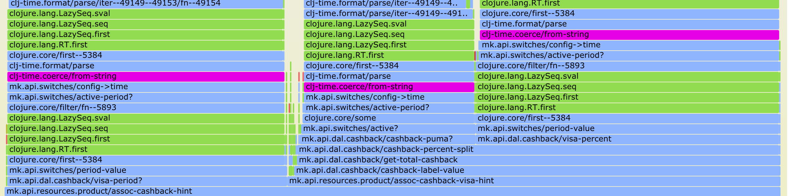

class: center, middle

# Make It Work. Fast.

.meta[<p>Alexander Solovyov<br>CTO @ kasta.ua</p>]

???

Hey, nice to see you all! My name is Alex and I work as CTO at Kasta since 2015.

---

# What is Kasta?

* Largest fashion-oriented marketplace in Ukraine
* 2k RPS sustained
* 10-20k packed orders per day

???

First, let's make it clear what are we talking about. It's an ecommerce
marketplace, you know, products, basket, checkout, all that stuff. We're not
exactly Amazon-scale, but not a walk in a park either.

---

class: center, middle

# Tales how we survive load peaks.<br>Blood, sweat and sales.

???

My friends are used to hearing my stories during a glass of beer, so maybe
you'll be interested too. The key difference here is that you'll see real
numbers from our metrics.

I should warn you this is almost programming-language agnostic talk, but we've
been a Python shop back in 2015. We've gone Clojure since, so be prepared to see
a few lines of Java. I know it can be a shock but don't say I have not warned you. :)


* mkday 16 atom: learn your runtime tooling, it's going to save you
* halloween 17 menu: Communication is important as ever during hard times.
* july 18 ddos: Building good monitoring is important
* kastaday 18 no product cache: Monitoring is really hard<br>But you will build it bit by bit
* nov 20 cashback: Don't parse dates if you can<br>And learn how to use profiler
* nov 20 hub: even Postgres is not a saint

* блек фрайди 15 кэш: если сервис уже медленный, сделать его быстрым очень тяжело

---

# MKDay 2016, 1 Aug

* First big sale on a new platform
* Clojure + ClojureScript + React
* In production since Feb 2016
* Fast CPU load growth lately under pressure
  * 30% RPS increase => 3x LA on servers

???

So we switched to Clojure and 4 of 5 main pages have been moved. Response time
decreased greatly, but since May, when we released new product listing,
something strange started happening: 30% load increase in turn increased CPU
load threefold.

We just did not believe it at first, since the symptoms were not consistent, and
I was in denial that my new shiny toy can do something atrocious like that. At
some point we succumbed to demands of reality and started trying to understand
what's going on.

---

# Thread dump

```
"worker-3" #35 daemon prio=5 os_prio=31 cpu=198.71ms elapsed=37693.68s tid=0x000000013c809400 nid=0x7e03 waiting on condition  [0x000000017309a000]
 java.lang.Thread.State: WAITING (parking)
*  at jdk.internal.misc.Unsafe.park
  at java.util.concurrent.locks.LockSupport.park
  at java.util.concurrent.locks.AbstractQueuedSynchronizer$ConditionNode.block
* at java.util.concurrent.ForkJoinPool.unmanagedBlock
```


???

We tried many things and one of them was JVM thread dumps. If you poke JVM with
a special stick, it'll give you a listing of all threads along with stacktrace
what this thread is doing. Quite basic and hard to read in raw form.

---

# Thread dump analyzers

.center.middle[]

???

There is a simple tool where you just load that text file and get nice summary
of what's going on. All of the threads are sitting in that thingie?!

---

# clojure.cache

* A caching library implementing various cache strategies
  * FIFO, LRU, LFU, TTL, etc
* In-memory cache
* Really fast, no network access

???

I thought it would be cool to experiment and used an in-memory library for
caching instead of memcached. It implements various caching strategies over
simple hash-maps, but doesn't store data by itself - that is your job. Of
course, it's really quick, because you just hit memory instead of going over the
network.

I used `atom` for storage.


---

# Atom

* https://clojure.org/reference/atoms
* Way to manage shared, .invert[synchronous], independent state
* Another thread may have changed the value in the intervening time, it may have to .invert[retry], and does so .invert[in a spin loop]

???

`atom` is a container where you can take data from and put data into. Usually
what you do is you apply a function to a value inside that atom, and that
changes it's data.

The key is this capability of being synchronous between all threads. If during
function call data was changed atom will call that function once again.

Do you know any other names for "spin loop"?

---

background-image: url(img/facepalm.png)

# SPIN LOOP

```java
public Object swap(IFn f) {
* for (; ;) {
    Object v = this.deref();
    Object newv = f.invoke(v);
    if (this.compareAndSet(v, newv) {
*     return newv;
    }
  }
}
```

???

When there are many threads trying to change that atom - infinite loop :)

---

```diff
commit a98153222b2f17a7407521cabee455e4e084ad55
Date:   Sun Jul 31 16:09:11 2016 +0300

*    switch to memcache for caching products

 resources/config.edn      |  5 +-
 src/mk/api/cache.clj      | 21 +++-
 .../resources/product.clj | 34 +++----
 3 files changed, 36 insertions(+), 24 deletions(-)
```

???

My son was two weeks old at the time, we were visiting my parents and with a
sale scheduled to 1 of August you can imagine I was pretty nervous. That was a
taste of things to come. :)


---

class: middle, center

## Key Insight
# Learn your runtime tooling,<br>it's going to save you

???

I should say sometimes learning new tools feels natural, especially when you
really feel the need. :) I suppose doing this in Python should be easy enough.

---

# Black Friday 2016

* My wife is in hospital being operated :(
* I'm trying to feed my 1/2 year old son
* Everything else is fine!

???

That was a weird ending to a busy year, but we went through fine even with me
swinging little one to sleep.

---

# Halloween 2017

* Losing TCP packets under load
* `main.js` barely loading
* Is that because of a new DC?
* High LA on load balancers?!

???

Right before Halloween we've moved to a new DC. So naturally when we started
losing packets during peaks of visits we blamed them! Thankfully they were
understanding and did everything to help, including giving us unmetered 10GB
channel, but it did not help.

I have no idea why we looked at load balancer CPU load, because we have never
had any issues there and that chart wasn't on any dashboard. But their load was over the top.

---

# Why

* Sep, 19: LA on load balancers started to grow
* Sep, 19: marketing published 4th level of menu
* API returns **full menu hierarchy**
* Hello 3 MB of JSON!

???

Whole company was worried what's going on, so when I talked to them, they all
were sharing what major things they did lately - maybe that's the reason? And
marketing sharing that a new level of categories went live a month ago was a key
to a problem.

So we have an API spewing 3 MB of JSON on every call. Also those 3 MB are
contained as "initial data" in every server-rendered HTML, as all of them have menu.

But the thing is, that can't saturate the link. Okay, it's a lot of data, but
all of it is cached and it's not Black Friday, so we're doing less than 2 GBs.

What is it then?

---

# Self-help

* Decreased gzip compression level
* Which we have increased two months before
* And reworked API before BF

???

Two months before that greatest minds ever decided that if we can't enable
brotli yet we want to compress gzip better. So we increased gzip compression
level.

Heroically conquering Citrix admin panel and decreasing it helped us live until
the next day. And we've converted API into responding with parts of menu next
week.

---

class: middle, center

## Key Insight
# Communication is important as ever during hard times.

???

I don't know, it seems like the key insight here is not to shut down all
communication when investigating an issue. I love diving in a hairy problem as
the next person is, but! Me nagging ops people about what they discovered and
then talking to other departments was key to understanding the problem.


---

# Black Friday 2017

- My son is in a hospital after a vaccine shot
- I'm also in a hospital, but less busy than last year
- Everything else is fine!

???

At that point I seriously contemplated leaving the company before next Black
Friday

---

# July 17, 2018

Messages in my Telegram:

* `00:30` we're dead since midnight and I have no idea why
* `01:16` just deployed a week old version and it seems to work better
* `02:31` we're being DDoS'ed :-)

???

- app has been logging lots of Netty (well-known async java web server) before
  being stuck
- deploying old version somehow forced app to work, albeit slowly
- that took calmed everybody down enough so we could start interpreting what our
  dashboards are trying to say

---

# July 17, 2018

* Too many requests to server rendering
* Server-side rendering causing too much load

???

Majority of our load during the normal day was coming from an API calls. We had
mobile apps and an SPA, so only a few of requests were for initial page rendering.

---

.center.middle[]

???

How do we know? Because we don't just render charts in Grafana from what our
infrastructure gives us, we actively send data from inside our application and
improve this reporting all the time. This means we're able to understand what is
going in our application pretty well.

Here's load on server render when normal is like 10 rps

---

# What's next

- Caching that page was really hard because of stuff
- Attacker went away at 3 AM and came back in the morning
- Super-secret fingerprinting system 💪
- Disabling server-side rendering for repeated visitors

???

- I think we were lucky that guy came back when we still haven't forgot him
- Started sending unrendered page, do some JS execution, haha

---

# Fingerprinting system

```
(def LIABLE ["user-agent" "cookie" "accept" 
             "accept-language" "accept-encoding"])

(defn fingerprint [{:keys [headers]}]
  (-> (select-keys headers LIABLE)
      (vals)
      (str/join ",")
      (sha1)))
```

---

.center.middle[]

---

class: middle, center

## Key Insight
# Aren't we stupid enough?<br>Why did that one attack us?

???

---

class: middle, center

## Key Insight
# Building good monitoring is important

---

# Kasta Day 2018, Aug 1-2 

* Yearly gut-check before the season
* Response time and DB load grew simultaneously



???

- We've renamed to Kasta and the sale has been renamed as well
- This time it's obvious! Something's hitting the database like a bulldozer.

---

# Enter `pg_stat_statements`!

- Stats on all queries Postgres is executing
- Longest query, most frequest query, etc
- Our products table was being hit really hard

???

I mean obvious because DB performance is something we pay attention since the
early days, it's one thing we can't scale horizontally. So we just went to check
what's going on. Looking at statistics for the last 15 minutes gave us insight:
amount of queries to DB table is much higher than anticipated, giving we're
running memcached before it.

So we just check that cache works and boooooom!

---

```diff
commit 6375790441ab03b8210448c52292dc7fec78408d
Date:   Wed Aug 1 10:28:39 2018 +0300

*    fix product cache

--- src/mk/api/resources/product.clj
+++ src/mk/api/resources/product.clj

    (future
-     (memcache/set id expiration)))))
+     (memcache/set id expiration item)))))

```

???

- That change was there since autumn of 2017, so we lived through Black Friday
  not having working cache and it was fine.
- Main reason is that we were a shopping club with 60k products max, and now it
  was about 300k or something

---

# Fix



???

With some extra-work response time was back to better than ever

---

class: middle, center

## Key Insight
# Monitoring is really hard<br>But you will build it bit by bit

???

Also that you don't really need any DDoS to feel pain, just relax a bit and your
service will practically eat itself.

---

class: center, middle

# Black Friday 2018

# Everything is fine 🎉

---

# 16 Nov 2020

* Black Friday is right around the corner
* App starts eating CPU like crazy
* Deploying previous release helps
* Changes are not suspicious

???

I mean it's Black Friday and we don't have anything to talk about? You bet!
Something's happening!

---

# Let's profile!

- We use `clj-async-profiler`
- Connect to a REPL of production server, start, then stop it and look at data
- Or on a separate server profile separate HTTP request
- Data is an SVG file for a browser
- For Python look at `py-spy`
  - Attaching in runtime, piercing Docker, you name it

---

# Profile



???

90% of profile is occupied by date parsing.

---

# Setup

- Cashback released a month ago
- Let's use it for marketing!
- Visa matches our rates if you pay with Visa card
- Puma just adds more on top for their products
- Both limited by time

???

- We have a fantastic new product - cashback! Like, honest stuff, real money,
  yada-yada, let's use it for marketing!
- So some additional cashback from Visa, and another thing from Puma
- But only for some time!

---

# Whyyyyyyy

- Put a string in your config
- Parse it when checking a switch - only happens once per request
- Add a tooltip about time-limited cashback for every product
- Sizes have different prices - parsing date for **every** SKU
- One call: 60 products × 3 sizes × parsing attempts

???

I mean it's like basic engineering: somebody did a little thingie to support his
task. Then somebody else extended that stuff, then reused it somewhere, and then
we have an app which dies with only a config change.

---

# Fix that

- Parse dates in config on app load

---

class: middle, center

## Key Insight
# Don't parse dates if you can<br>And learn how to use profiler

???

Also, learn to profile. I once discovered that just updating SQLAlchemy sped up
our system twice.

---

# 24 Nov 2020

- Hub is an interface for suppliers
- Starts, makes a few requests to DB
- In 2 to 5 seconds since first request stops asking the DB
- App still works though!

???

So it's Tuesday of Black Friday week, and in the morning Hub starts behaving
weirdly. I'm not too worried, Hub's team lead and our ops guys go to investigate
but it's fruitless, and in a few hours me and site's lead join them.

---

# Investigation

- No stacktraces - is it a JVM bug?
- No requests coming to a DB - is it a network?
- Maybe it's a Postgres driver?
- What about the pgbouncer? Nah, but let's check
- Is it Postgres itself? Well, it seems to work well...

---

# But what is it?!

- About 20 hours later...
- We started executing `SELECT` by `SELECT`
- And many of them are stuck with **no logs** from DB
- Single page of a really popular table got corrupted
- We just couldn't believe Postgres did not have our backs :-)

???

This really was a painful day and I wish I could forget that. I should thank all
gods that the rest of the week was calm since we were really tired. 

---

# Postmortem

- We got too used to discovering issues with a good guess
- Too many false directions
- We did not keep a list of things to check
- Repeated checks
- Too late with a scientific method

???

Honestly, I blame those 20 hours of investigation on fatigue, because I
can't understand why it took so long to start doing this experiment.

I'd say the right way was to get two separate groups: one focused on a fast
issue checking, another one on a thoughtful investigation.

---

class: center, middle

## Key Insight
# Even Postgres is not a saint<br>.transparent[Also, don't be tired]

???

We just couldn't comprehend that Postgres could be dying without giving at least
something in the logs.

---

class: center, middle

# Questions? Comments?
