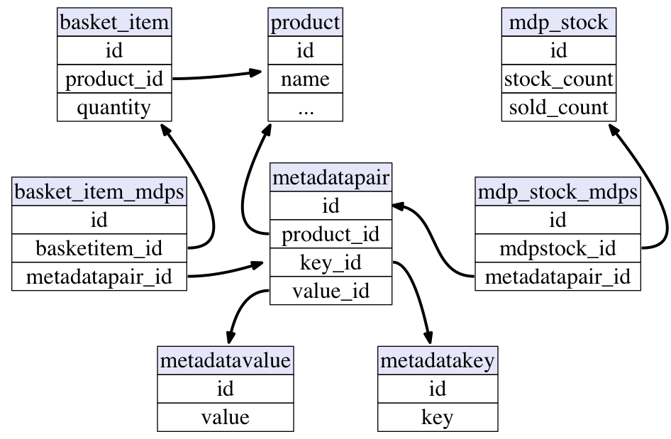
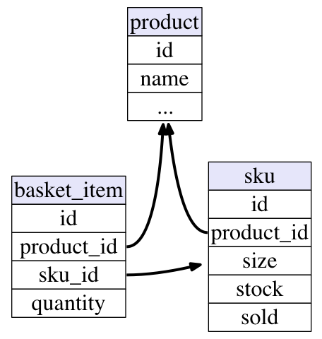

class: center, middle

# Embrace the Change

.meta[
Alexander Solovyov
]

???

Hey everyone, today we're going to talk about building change-resilient
systems.

---

# Change is the way

- World is ever-changing
- And businesses too!

???

Every business book or a course will tell you that the most important thing to
optimize for is the speed of change that business can sustain. If you can't adapt
to the world's changing needs faster than your competitors, compound interest of
that difference will crush the business in a few years.

---

# Main goal of the CTO

- Writing good code?
- Building great architecture?
- Making others do that? A.k.a. building a team?

???

It's surprising, but I now think that while building a team, growing your system
and nurturing good code is important, it's not the main goal of a good CTO. What
is it though? Listen on! :)

---

# How do I know?

- CTO @ kasta.ua for 8 years
- Full rewrite
- Two complete business model changes
- Total front-end turnaround

???

Kasta.ua is a leading fashion online marketplace in Ukraine and during my tenure
we changed so much it's hard to even start describing that. Kasta is not the
biggest player in Ukrainian ecommerce and so had to run fast to even survive and
we did. Right now Kasta has culture and abilities to make changes extremely
swiftly, thanks to our efforts.

---

# Sources of change

- Hard to predict
- Technical
- People and processes

???

If you want to build something to last, you can't predict what's going to
change. Could be anything! The market can change, your perception of that market
can change, your assumptions about user behavior could be wrong, a war could
happen, like, anything!

---

class: center, middle

# Technical

???

We still can categorize concerns into technical and non-technical.

---

# Data

- Data is company's blood
- Data layout = life's quality

???

I firmly believe in saying "Data is King". That's the foundation your system is
standing on, practically the blood of the business. And if you're not paying
attention to ways you store and work with the data, you're going to have a hard
time adapting to change.

---

class: center, middle

???

Just a small example, let's imagine we have this abomination as a part of our DB
schema. I don't think I have enough time to explain this, but it took me three
weeks to understand what is going on. You'll have to believe me what would
a simpler version look like...

---

class: center, middle

???

It's just that! Just a product, variation and an item in a basket. Obviously a
schema like that can sustain much more damage. We transitioned from a flash sale
to a general merchandise, and then to a marketplace - and both those transitions
have changed company through and through, and our little schema held up well
against changes.

---

# Data

- Love your data
- Nurture its layout

???

Not always the change we've designed was the most efficient we could have
done. But it takes time to see the problem clearly and you don't always have
that time.

So what we did? Obviously - we fixed our problems. Sometimes it took years to
get layout into a satisfying state of simplicity and synchronize it clearly with
business needs, but that state was good as a launchpad for further changes.

---

# Architecture

- Keep it simple
- Complex solutions - slow to change

???

This one is obvious in my opinion, but skipping it is not an option. :-) When
all you have is a single process, changes are really easy. When you decide to
build that microservices architecture, suddenly all your mistakes become coded
into a distributed network and that stuff is really resistant to change. Note:
resistant, not resilient.

---

# John Gall's law

> A **complex** system that works is invariably found to have **evolved** from a **simple** system that works. 
> The inverse proposition also appears to be true: A **complex** system designed **from scratch never works** and cannot be made to work.

???

So, John Gall said and everyone agrees that you can't create complex system from
scratch. I want to add that simplifying existing system before critical changes
could be much easier than changing complex system.

---

# Tools

- Programming language and runtime
- The way you code
  - Indirection makes change harder
  - Modularization makes it easier
- "Simple Made Easy" by Rich Hickey

???

Tools are really important. Programming community tends to discount that a
little bit - like, "programming language does not matter", but this is obviously
incredibly wrong. Building with dynamic languages is faster, fixing bugs in
statically typed codebases is easier, some languages are more productive than
others, ecosystems have different strong sides.

When I was trying out Vespa, it took me an hour to speed up indexing to a 1000
documents per second, since I was using JVM for that. On the other hand, my
brother had to write an extension in Rust to get to an acceptable speed, since
getting over a 100 documents per second in Python was too hard.

What would be easier to change if a need arises? Poor performance impacts your
ability to build simple systems. It's not to say that your system will be easier
if it's built in Rust, but there is certainly a spectrum you can choose from.

Or let's take OOP. If you take Django and implement most of your logic in Model
methods, you're going to get big hairy ball of mud as your architecture, closely
tied to schema with limited ability to change.

God bless you if you're using inheritance instead of interfaces. Just go watch Rich
Hickey's talk "Simple made easy".

---

# Backward Compatibility

- Hinders change
- Largely cultural
- Not binary
- Do not break without planning

???

I'm quite convinced that backward compatibility is utterly important. So, on one
hand, if people are dependendent on results of your work, do not make them work
more just because a new name for a database column is better than the previous
name.

On the other, sometimes you just need to do that. When business needs are
changing a lot, learn to coordinate to migrate to a new APIs, to a new data
layout, new data exchange patterns.

It's a fine balance between creating additional work without the necessity and
keeping your system simple, but you'll have to learn. For sure culture of
breaking backward compatibility in a nice and controlled way is an important
skill.

---

# Summing it up

- Care for data
- Strive for simplicity
- Efficient and effective tools
- Culture of changes

???

To sum it up: data is your foundation, take care. Having a simple architecture
gives you options. Better tools give better options still. And culture is
important, as always, which leads us to...

---

class: middle, center

# People

---

# Why are you CTO?

- Leverage
- Impact
- Bringing ideas to life faster

???

Why are you CTO? To have more leverage, to deepen impact you can have, to bring
ideas to life faster than you ever could do that yourself.

--

## .center[That's all done by other people!]

---

# People are critical

- Know them
- Grow and educate them
- Fire wrong people

???

This slide is kind of obvious, right? Well, even if obvious, caring is hard, so
think about it a little. Knowing people means you can give the work they find
more satisfying - and so are faster and more efficient, or having the better
words for support, and finding a better and more efficient way to grow
them... Make them feel appreciated and you won't have burnouts.

Even if that means firing an underperformer. That one is still mind-blowing to
me, but just firing wrong person can make a team twice as fast and twice as
able.

---

# Train with them to make changes

- Increase level of change step by step
- Grow until the team is not afraid of any changes
- Push them!

???

When I just started working at Kasta, the team there did not track database
migrations. The reason is simple - they never changed the database. And, among
other problems, password restore page wasn't working: regexp for that url
pattern was broken. So we started with fixes like that and implemented db
migration tracking, then progressed to fix db schema and long-standing issues
like overselling, and then in just a year we changed business model.

On one hand, you can't just woke up one morning and do big changes with an
inexperienced team. On the other, it's amazing how fast people are going to
learn if you push them.

And you should push them. Some are afraid of change, some hate being out of
comfort zone, there are various reasons - but most people study faster and feel
more accomplished if you push them.

---

# So what's the main goal of the CTO

- The goal is to build a resilient system
- It's a team than can build fast with a quick resolve
- And a codebase which is complex enough to support business, but simple enough
  to absorb changes

---

class: middle, center

# Thanks!

solovyov.net  
t.me/bitethebyte
